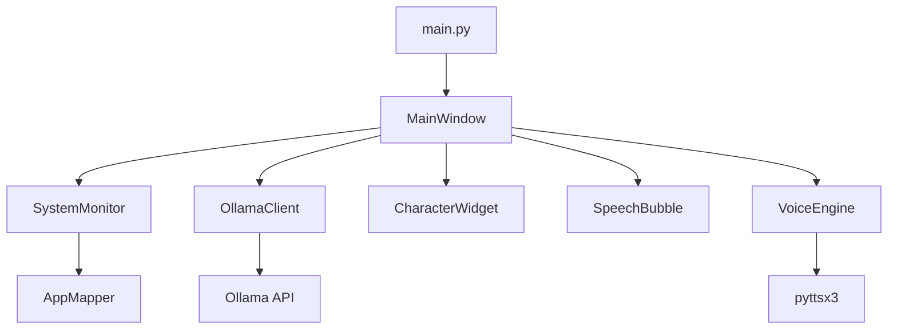

# 📚 Documentation API

Guide complet pour développeurs souhaitant étendre ou modifier l'Assistant IA.

## 🏗️ Architecture générale



## 📦 Modules principaux

### `core/system_monitor.py`

#### Classe `SystemMonitor`

Surveille l'activité système et détecte les changements d'applications.

```python
class SystemMonitor:
    def __init__(self, callback: Callable[[str, str], None])
    def start(self) -> None
    def stop(self) -> None
    def get_usage_stats(self) -> Dict[str, float]
    def reset_stats(self) -> None
```

**Méthodes publiques :**

##### `__init__(callback)`
```python
monitor = SystemMonitor(callback=my_callback_function)
```
- **callback** : Fonction appelée lors d'un changement d'app
- **Signature callback** : `(app_name: str, context: str) -> None`

##### `start()` / `stop()`
```python
monitor.start()    # Démarre la surveillance
monitor.stop()     # Arrête la surveillance
```

##### `get_usage_stats()`
```python
stats = monitor.get_usage_stats()
# Retourne : {"Chrome": 1200.5, "VS Code": 800.2, ...}
```

**Configuration :**
```python
# Dans settings.py
settings.monitoring.check_interval = 5  # Intervalle en secondes
settings.monitoring.ignored_processes = ['system', 'registry']
```

**Exemple d'usage :**
```python
def on_app_change(app_name, context):
    print(f"App changée : {app_name} - {context}")

monitor = SystemMonitor(on_app_change)
monitor.start()
```

---

### `core/ollama_client.py`

#### Classe `OllamaClient`

Interface avec l'API Ollama pour générer des suggestions IA.

```python
class OllamaClient:
    def __init__(self, base_url: str = None, model: str = None)
    def check_connection(self) -> bool
    def generate_suggestion(self, app_name: str, context: str) -> str
    def get_available_models(self) -> list
    def test_model(self, prompt: str) -> Dict[str, Any]
```

**Méthodes publiques :**

##### `generate_suggestion(app_name, context)`
```python
client = OllamaClient()
suggestion = client.generate_suggestion("Chrome", "Navigation web")
# Retourne : "Essaie Ctrl+Shift+T pour rouvrir un onglet !"
```

##### `check_connection()`
```python
if client.check_connection():
    print("Ollama disponible")
```

##### `get_available_models()`
```python
models = client.get_available_models()
# Retourne : ["llama3.2", "mistral", "codellama"]
```

**Configuration personnalisée :**
```python
# Prompts personnalisés par catégorie
def _create_custom_prompt(self, app_name, context, category):
    if app_name == "MonApp":
        return "Prompt spécialisé pour MonApp..."
    return self._create_contextual_prompt(app_name, context, category)
```

**Exemple d'extension :**
```python
class CustomOllamaClient(OllamaClient):
    def generate_code_suggestion(self, code_snippet: str) -> str:
        prompt = f"Améliore ce code :\n{code_snippet}"
        # ... logique personnalisée
```

---

### `utils/voice_engine.py`

#### Classe `VoiceEngine`

Gère la synthèse vocale avec queue et configuration avancée.

```python
class VoiceEngine:
    def speak(self, text: str, priority: bool = False) -> None
    def stop(self) -> None
    def is_speaking(self) -> bool
    def set_voice_properties(self, rate: int, volume: float, voice_id: str) -> None
    def get_available_voices(self) -> list
    def test_voice(self, text: str) -> None
```

**Méthodes publiques :**

##### `speak(text, priority=False)`
```python
voice_engine.speak("Bonjour !")
voice_engine.speak("Message urgent !", priority=True)  # Coupe la queue
```

##### `set_voice_properties()`
```python
voice_engine.set_voice_properties(
    rate=150,      # Vitesse (mots/min)
    volume=0.9,    # Volume (0.0-1.0)
    voice_id="french_voice_id"
)
```

##### `get_available_voices()`
```python
voices = voice_engine.get_available_voices()
for voice in voices:
    print(f"{voice['name']} - {voice['languages']}")
```

**Personnalisation du nettoyage de texte :**
```python
def custom_clean_text(self, text: str) -> str:
    # Votre logique de nettoyage
    text = text.replace("@", "arobase")
    text = re.sub(r'#\w+', 'hashtag', text)
    return text
```

---

### `ui/character.py`

#### Classe `CharacterWidget`

Widget personnage avec animations et humeurs.

```python
class CharacterWidget(tk.Frame):
    def set_mood(self, mood: str) -> None
    def draw_character(self) -> None
    def start_animation(self) -> None
    def stop_animation(self) -> None
```

**Humeurs disponibles :**
- `"neutral"` - État par défaut
- `"happy"` - Content (après suggestion)
- `"thinking"` - Réflexion (génération IA)
- `"confused"` - Confus
- `"working"` - Au travail

**Ajouter une nouvelle humeur :**
```python
def _define_moods(self):
    self.moods.update({
        "excited": {
            "eye_shape": "normal",
            "mouth_shape": "big_smile", 
            "body_color": "#FFD700",
            "animation": "bounce"
        }
    })
```

**Nouvelles animations :**
```python
def _get_animation_offset(self):
    # Ajouter votre logique d'animation
    if animation == "rotate":
        angle = math.sin(self.animation_frame * 0.1) * 10
        return self._rotate_offset(angle)
```

---

### `utils/app_mapper.py`

#### Classe `AppMapper`

Mappe les noms de processus vers des noms conviviaux et catégories.

```python
class AppMapper:
    def get_display_name(self, process_name: str) -> str
    def get_context(self, app_name: str) -> str
    def get_app_category(self, app_name: str) -> str
    def add_custom_mapping(self, process_name: str, display_name: str, context_template: str) -> None
```

**Ajouter des applications personnalisées :**
```python
app_mapper.add_custom_mapping(
    process_name="myapp.exe",
    display_name="Mon Application",
    context_template="Utilisation de Mon App ({time})"
)
```

**Nouvelles catégories :**
```python
# Modifier dans app_mapper.py
categories = {
    'Design': ['photoshop.exe', 'illustrator.exe', 'figma.exe'],
    'Gaming': ['steam.exe', 'epicgames.exe'],
    # ... vos catégories
}
```

---

## 🔧 Configuration avancée

### `config/settings.py`

Structure de configuration centralisée :

```python
@dataclass
class OllamaConfig:
    base_url: str = "http://localhost:11434"
    model: str = "llama3.2"
    timeout: int = 15
    max_tokens: int = 100
    temperature: float = 0.7

@dataclass  
class UIConfig:
    window_width: int = 200
    window_height: int = 250
    always_on_top: bool = True
    background_color: str = "#f0f0f0"

@dataclass
class MonitoringConfig:
    check_interval: int = 5
    score_memory_threshold: int = 50
    ignored_processes: List[str] = None
```

**Modifier la configuration :**
```python
# Dynamiquement
settings.ollama.model = "mistral"
settings.ui.window_width = 300

# Via environnement (.env)
OLLAMA_MODEL=mistral
UI_WINDOW_WIDTH=300
```

---

## 🔌 Extension et plugins

### Créer un nouveau module

1. **Créer le fichier** dans le bon dossier (`core/`, `ui/`, `utils/`)

```python
# utils/my_extension.py
class MyExtension:
    def __init__(self):
        self.enabled = True
    
    def process(self, data):
        # Votre logique
        return processed_data
```

2. **Intégrer** dans `main_window.py`

```python
from ..utils.my_extension import MyExtension

class MainWindow:
    def __init__(self):
        # ...
        self.my_extension = MyExtension()
    
    def _on_app_changed(self, app_name, context):
        # Utiliser votre extension
        processed = self.my_extension.process((app_name, context))
        # ...
```

### Hooks et callbacks

Système d'événements pour étendre facilement :

```python
# Exemple de système de hooks
class EventManager:
    def __init__(self):
        self.hooks = {}
    
    def register_hook(self, event: str, callback):
        if event not in self.hooks:
            self.hooks[event] = []
        self.hooks[event].append(callback)
    
    def fire_event(self, event: str, data):
        for callback in self.hooks.get(event, []):
            callback(data)