# 🔄 Schéma Mermaid - Circulation complète des données

## 📊 Diagramme avec transformations et prompts détaillés

```mermaid
graph TD
    %% === ENTRÉE UTILISATEUR ===
    USER[👤 Utilisateur<br/>Input: Crée un script Python] --> INPUT_PROCESS[📥 Input Processing<br/>message = Crée un script Python<br/>timestamp = 2025-07-08T14:30:45]
    
    %% === DÉTECTION MOTS-CLÉS ===
    INPUT_PROCESS --> KEYWORD_DETECT{🔍 Détection mots-clés<br/>Keywords: crée, script, génère<br/>is_file_command = True}
    
    KEYWORD_DETECT -->|Mots-clés détectés| ROUTE_FILE[📁 Route vers File Manager<br/>destination = file_manager<br/>confidence = 0.95]
    KEYWORD_DETECT -->|Pas de mots-clés| ROUTE_CHAT[💬 Route vers Chat<br/>destination = conversation]
    
    %% === ENHANCED FILE MANAGER ===
    ROUTE_FILE --> FILE_MANAGER[📁 Enhanced File Manager<br/>process_command Crée un script Python]
    
    %% === PREMIÈRE ANALYSE LLM ===
    FILE_MANAGER --> LLM1_PROMPT[🤖 LLM Classification<br/>PROMPT: Tu es un assistant IA local<br/>Transforme en JSON structuré<br/>Actions: creer, lancer, webscrap_pdf<br/>Options: temp=0.3, predict=200]
    
    LLM1_PROMPT --> OLLAMA1[(🤖 Ollama API<br/>Model: llama3.2)]
    OLLAMA1 --> LLM1_RESPONSE[📤 Réponse LLM 1<br/>JSON: action creer<br/>fichier script.py<br/>chemin python]
    
    %% === EXTRACTION JSON ===
    LLM1_RESPONSE --> JSON_EXTRACT[📄 Extract JSON<br/>regex: JSON pattern<br/>json.loads]
    JSON_EXTRACT --> JSON_VALID{✅ JSON valide?}
    
    JSON_VALID -->|Oui| PARSED_JSON[📋 JSON parsé<br/>action = creer<br/>fichier = script.py<br/>chemin = python]
    JSON_VALID -->|Non| FALLBACK[⚠️ Fallback Analysis<br/>Pattern matching]
    
    %% === AMÉLIORATION NOM FICHIER ===
    PARSED_JSON --> FILENAME_LLM[🎯 LLM Nom fichier<br/>PROMPT: Propose un nom pertinent<br/>pour: Crée un script Python<br/>Format: xxx.py<br/>Options: temp=0.1, predict=20]
    
    FILENAME_LLM --> OLLAMA2[(🤖 Ollama API<br/>Model: llama3.2)]
    OLLAMA2 --> FILENAME_RESPONSE[📤 Nom amélioré<br/>utilitaire_python.py]
    
    %% === ROUTAGE ACTION ===
    FILENAME_RESPONSE --> ACTION_ROUTER{🎯 Type d'action<br/>action = creer}
    
    ACTION_ROUTER -->|creer| CODE_GENERATION[📝 Code Generation]
    ACTION_ROUTER -->|lancer| CODE_EXECUTION[🚀 Code Execution]
    ACTION_ROUTER -->|webscrap_pdf| WEB_SCRAPING[🌐 Web Scraping]
    ACTION_ROUTER -->|liste_fichiers| FILE_LISTING[📂 File Listing]
    
    %% === GÉNÉRATION CODE ===
    CODE_GENERATION --> CODE_LLM_PROMPT[🤖 LLM Code Expert<br/>PROMPT: Tu es expert programmeur Python<br/>TÂCHE: Script complet fonctionnel<br/>EXIGENCES: Structure claire<br/>FORMAT: Commence par shebang<br/>Options: temp=0.1, predict=500]
    
    CODE_LLM_PROMPT --> OLLAMA3[(🤖 Ollama API<br/>Model: llama3.2)]
    OLLAMA3 --> CODE_RESPONSE[📤 Code généré<br/>Script Python complet<br/>87 lignes, 2847 bytes]
    
    %% === NETTOYAGE ET VALIDATION ===
    CODE_RESPONSE --> CODE_CLEAN[🧹 Nettoyage code<br/>Supprimer markdown<br/>Enlever explications<br/>Vérifier structure]
    
    CODE_CLEAN --> CODE_VALIDATE[✅ Validation<br/>Longueur > 30 chars<br/>Structures Python présentes<br/>Parenthèses équilibrées]
    
    CODE_VALIDATE -->|Valid| CODE_OK[✅ Code validé]
    CODE_VALIDATE -->|Invalid| CODE_RETRY[🔄 Retry génération]
    CODE_RETRY --> CODE_LLM_PROMPT
    
    %% === CRÉATION FICHIER ===
    CODE_OK --> FILE_PATH[📁 Préparation chemin<br/>target_dir = Documents/AI_Assistant_Files/python<br/>file_path = utilitaire_python.py]
    
    FILE_PATH --> FILE_WRITE[💾 Écriture fichier<br/>Ouverture en mode écriture<br/>Sauvegarde du code]
    
    FILE_WRITE --> FILE_SUCCESS{📄 Fichier créé?}
    FILE_SUCCESS -->|Oui| FILE_CREATED[✅ Fichier créé<br/>Taille: 2847 bytes<br/>Lignes: 87]
    FILE_SUCCESS -->|Non| FILE_ERROR[❌ Erreur création]
    
    %% === HISTORIQUE ===
    FILE_CREATED --> HISTORY_ENTRY[📋 Création entrée historique<br/>id = abc12345<br/>timestamp = 2025-07-08T14:30:47<br/>command = Crée un script Python<br/>success = True]
    
    HISTORY_ENTRY --> HISTORY_SAVE[💾 Sauvegarde historique<br/>Charger historique.json<br/>Ajouter entrée<br/>Limiter à 100 entrées]
    
    HISTORY_SAVE --> HISTORY_FILE[(📁 historique.json<br/>Array d'entrées<br/>Format JSON)]
    
    %% === FORMATAGE RÉSULTAT ===
    FILE_CREATED --> RESULT_FORMAT[📋 Formatage résultat<br/>Fichier créé: utilitaire_python.py<br/>Emplacement et aperçu du code]
    
    %% === INTERFACE UTILISATEUR ===
    RESULT_FORMAT --> UI_UPDATE[🖥️ Mise à jour UI<br/>speech_bubble.update_text result<br/>character.set_mood happy]
    
    UI_UPDATE --> SPEECH_BUBBLE[💬 Speech Bubble<br/>Affichage texte formaté<br/>Scroll automatique]
    UI_UPDATE --> CHARACTER_MOOD[😊 Character Animation<br/>Mood: happy<br/>Animation: bounce]
    
    %% === SYNTHÈSE VOCALE ===
    UI_UPDATE --> VOICE_CHECK{🔊 Voix activée?<br/>voice_enabled = True}
    
    VOICE_CHECK -->|Oui| VOICE_PREPARE[🎵 Préparation voix<br/>Nettoyage texte<br/>Fichier créé utilitaire python point py]
    VOICE_CHECK -->|Non| VOICE_SKIP[⏭️ Skip voix]
    
    VOICE_PREPARE --> VOICE_ENGINE[🔊 Voice Engine<br/>pyttsx3.say clean_text<br/>Queue vocale]
    
    VOICE_ENGINE --> TTS_OUTPUT[🗣️ Synthèse vocale<br/>Audio output<br/>Français, 180 wpm]
    
    %% === RÉACTIVATION CONTRÔLES ===
    SPEECH_BUBBLE --> CONTROLS_ENABLE[🔄 Réactivation contrôles<br/>chat_widget.on_response_received<br/>Retour surveillance après 30s]
    CHARACTER_MOOD --> CONTROLS_ENABLE
    TTS_OUTPUT --> CONTROLS_ENABLE
    VOICE_SKIP --> CONTROLS_ENABLE
    
    CONTROLS_ENABLE --> END_FLOW[🏁 Fin du flux<br/>Total: 3.2 secondes<br/>LLM calls: 3<br/>Success: True]
    
    %% === AUTRES BRANCHES ===
    ROUTE_CHAT --> CHAT_LLM[🤖 LLM Chat Direct<br/>Conversation normale]
    CHAT_LLM --> OLLAMA_CHAT[(🤖 Ollama API)]
    OLLAMA_CHAT --> CHAT_RESPONSE[💬 Réponse chat]
    CHAT_RESPONSE --> UI_UPDATE
    
    CODE_EXECUTION --> EXEC_SUBPROCESS[🔧 Subprocess<br/>python3 script.py]
    EXEC_SUBPROCESS --> EXEC_RESULT[📊 Résultat exécution]
    EXEC_RESULT --> RESULT_FORMAT
    
    WEB_SCRAPING --> SEARCH_API[🔍 DuckDuckGo API<br/>Recherche web]
    SEARCH_API --> SCRAPE_CONTENT[📰 Scraping contenu]
    SCRAPE_CONTENT --> LLM_SUMMARY[🤖 LLM Résumé]
    LLM_SUMMARY --> PDF_CREATE[📄 Création PDF]
    PDF_CREATE --> RESULT_FORMAT
    
    FILE_LISTING --> LIST_FILES[📂 os.listdir]
    LIST_FILES --> RESULT_FORMAT
    
    FALLBACK --> BASIC_ANALYSIS[⚙️ Analyse basique<br/>Pattern matching<br/>Mots-clés simples]
    BASIC_ANALYSIS --> ACTION_ROUTER
    
    %% === STOCKAGE ===
    FILE_WRITE --> BASE_DIR[(📁 Documents/AI_Assistant_Files<br/>Dossiers: python, html, documents, recherches)]
    
    %% === MÉTRIQUES ===
    END_FLOW --> METRICS[📊 Métriques<br/>Total: 3.2s<br/>LLM: 3.4s soit 80%<br/>Fichier: 0.15s<br/>UI: 0.049s<br/>Tokens: 687]
    
    %% === STYLES ===
    classDef userInput fill:#e1f5fe,stroke:#01579b,stroke-width:2px
    classDef processing fill:#f3e5f5,stroke:#4a148c,stroke-width:2px
    classDef llm fill:#fff3e0,stroke:#e65100,stroke-width:3px
    classDef storage fill:#e8f5e8,stroke:#1b5e20,stroke-width:2px
    classDef output fill:#fce4ec,stroke:#880e4f,stroke-width:2px
    classDef external fill:#f1f8e9,stroke:#33691e,stroke-width:2px
    classDef decision fill:#fff9c4,stroke:#f57f17,stroke-width:2px
    classDef error fill:#ffebee,stroke:#c62828,stroke-width:2px
    
    class USER,INPUT_PROCESS userInput
    class KEYWORD_DETECT,JSON_VALID,ACTION_ROUTER,CODE_VALIDATE,FILE_SUCCESS,VOICE_CHECK decision
    class FILE_MANAGER,CODE_GENERATION,CODE_CLEAN,FILE_PATH,HISTORY_ENTRY processing
    class LLM1_PROMPT,CODE_LLM_PROMPT,FILENAME_LLM,OLLAMA1,OLLAMA2,OLLAMA3,LLM_SUMMARY llm
    class HISTORY_FILE,BASE_DIR,FILE_WRITE storage
    class UI_UPDATE,SPEECH_BUBBLE,CHARACTER_MOOD,VOICE_ENGINE,TTS_OUTPUT,END_FLOW output
    class SEARCH_API,EXEC_SUBPROCESS external
    class FALLBACK,FILE_ERROR,CODE_RETRY error
```

## 📊 Légende des couleurs

- 🔵 **Bleu** : Entrées utilisateur et traitement initial
- 🟡 **Jaune** : Points de décision et branchements
- 🟣 **Violet** : Traitement et logique métier
- 🟠 **Orange** : Appels LLM et IA (goulots d'étranglement)
- 🟢 **Vert** : Stockage et persistance
- 🔴 **Rouge** : Sorties et interface utilisateur
- 🟤 **Marron** : Services externes
- ⚫ **Gris** : Gestion d'erreurs et fallbacks

## 🎯 Points critiques du flux

1. **🤖 3 appels LLM séquentiels** (80% du temps total)
2. **🔍 Double validation** (mots-clés + LLM) 
3. **💾 Persistance multiple** (fichier + historique)
4. **🎭 Feedback multi-modal** (visuel + audio)
5. **⚡ Optimisations possibles** : cache LLM, patterns avancés